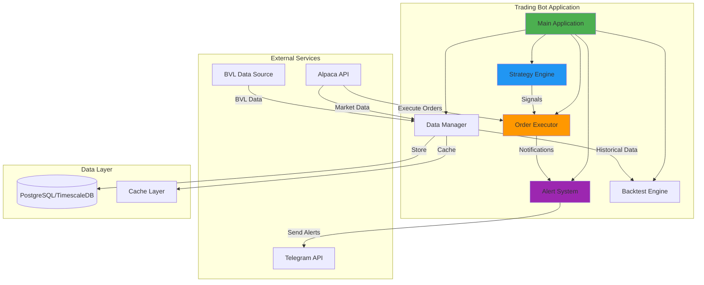
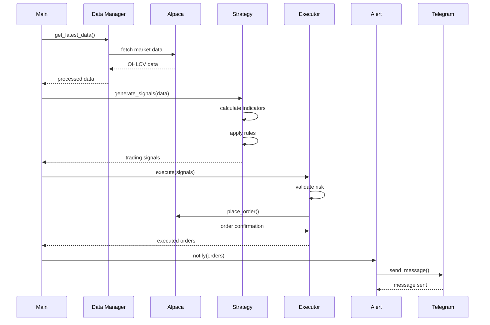
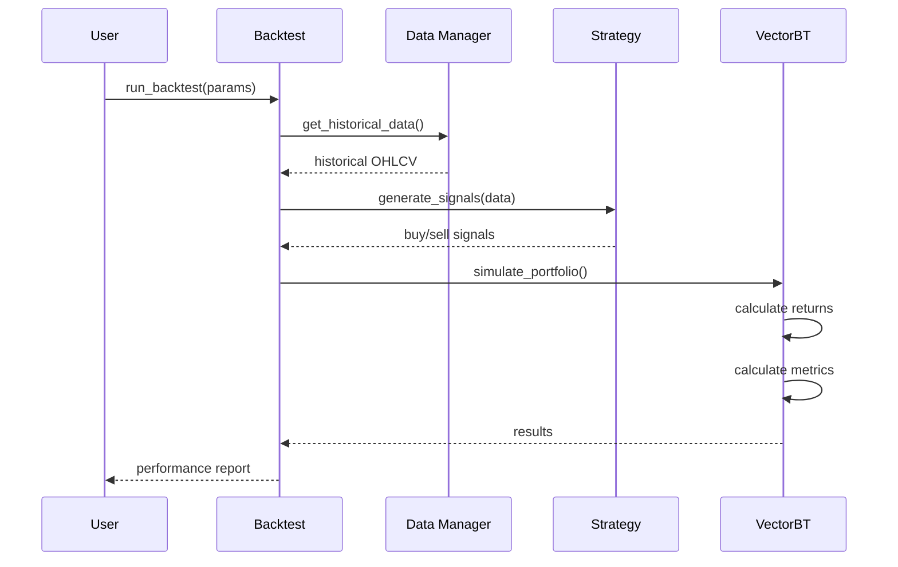

# 🏗️ Visión General de la Arquitectura

Documentación de la arquitectura del Trading Bot Híbrido.

## 📊 Diagrama de Arquitectura de Alto Nivel



## 🎯 Principios de Arquitectura

### 1. Modularidad
- Componentes independientes y reutilizables
- Bajo acoplamiento, alta cohesión
- Interfaces bien definidas

### 2. Escalabilidad
- Diseño para crecimiento horizontal
- Procesamiento asíncrono cuando sea posible
- Uso eficiente de recursos

### 3. Mantenibilidad
- Código limpio y documentado
- Patrones de diseño consistentes
- Fácil de entender y modificar

### 4. Confiabilidad
- Manejo robusto de errores
- Logging comprehensivo
- Mecanismos de retry y fallback

### 5. Seguridad
- Credenciales en variables de entorno
- Validación de inputs
- Auditoría de operaciones

## 🧩 Componentes Principales

### 1. Main Application (`src/main.py`)

**Responsabilidad**: Punto de entrada y orquestación

```python
"""
Orquesta todos los componentes del sistema.
Inicializa servicios, gestiona el ciclo de vida.
"""

class TradingBot:
    def __init__(self):
        self.config = self.load_config()
        self.data_manager = DataManager(self.config)
        self.strategy_engine = StrategyEngine(self.config)
        self.order_executor = OrderExecutor(self.config)
        self.alert_system = AlertSystem(self.config)
    
    def run(self):
        """Ciclo principal del bot."""
        while True:
            # 1. Obtener datos
            data = self.data_manager.get_latest_data()
            
            # 2. Generar señales
            signals = self.strategy_engine.generate_signals(data)
            
            # 3. Ejecutar órdenes
            if signals:
                orders = self.order_executor.execute(signals)
                
                # 4. Enviar alertas
                self.alert_system.notify(orders)
            
            # 5. Esperar siguiente ciclo
            time.sleep(self.config['cycle_interval'])
```

### 2. Strategy Engine

**Responsabilidad**: Generación de señales de trading

```python
"""
Gestiona estrategias de trading y genera señales.
"""

class StrategyEngine:
    def __init__(self, config):
        self.strategies = self.load_strategies(config)
    
    def generate_signals(self, data):
        """Genera señales de todas las estrategias activas."""
        all_signals = []
        
        for strategy in self.strategies:
            signals = strategy.generate_signals(data)
            all_signals.append(signals)
        
        return self.aggregate_signals(all_signals)
```

### 3. Data Manager

**Responsabilidad**: Gestión de datos de mercado

```python
"""
Obtiene, procesa y almacena datos de mercado.
"""

class DataManager:
    def __init__(self, config):
        self.alpaca_client = AlpacaClient(config)
        self.db = Database(config)
        self.cache = CacheLayer()
    
    def get_latest_data(self, symbol, timeframe='1Min'):
        """Obtiene datos más recientes."""
        # Intentar desde cache
        cached = self.cache.get(f"{symbol}:{timeframe}")
        if cached:
            return cached
        
        # Obtener de API
        data = self.alpaca_client.get_bars(symbol, timeframe)
        
        # Cachear y retornar
        self.cache.set(f"{symbol}:{timeframe}", data)
        return data
```

### 4. Order Executor

**Responsabilidad**: Ejecución de órdenes

```python
"""
Ejecuta órdenes de trading en el broker.
"""

class OrderExecutor:
    def __init__(self, config):
        self.broker = AlpacaBroker(config)
        self.risk_manager = RiskManager(config)
    
    def execute(self, signals):
        """Ejecuta órdenes basadas en señales."""
        orders = []
        
        for signal in signals:
            # Validar con risk management
            if self.risk_manager.validate(signal):
                order = self.broker.place_order(signal)
                orders.append(order)
        
        return orders
```

### 5. Alert System

**Responsabilidad**: Notificaciones y alertas

```python
"""
Sistema de alertas multi-canal.
"""

class AlertSystem:
    def __init__(self, config):
        self.telegram = TelegramBot(config)
        self.email = EmailNotifier(config)
    
    def notify(self, orders):
        """Envía notificaciones de órdenes ejecutadas."""
        for order in orders:
            message = self.format_message(order)
            
            if self.config['telegram_enabled']:
                self.telegram.send(message)
            
            if self.config['email_enabled']:
                self.email.send(message)
```

## 🔄 Flujo de Datos

### Flujo de Trading en Tiempo Real



### Flujo de Backtesting



## 📦 Estructura de Directorios

```
trading-bot/
├── src/
│   ├── __init__.py
│   ├── main.py                 # Aplicación principal
│   ├── strategies/             # Estrategias de trading
│   │   ├── __init__.py
│   │   ├── base.py            # Clase base
│   │   ├── rsi_strategy.py
│   │   └── ma_strategy.py
│   ├── data/                   # Gestión de datos
│   │   ├── __init__.py
│   │   ├── data_manager.py
│   │   └── cache.py
│   ├── brokers/                # Integraciones con brokers
│   │   ├── __init__.py
│   │   ├── alpaca_client.py
│   │   └── base_broker.py
│   ├── execution/              # Ejecución de órdenes
│   │   ├── __init__.py
│   │   ├── order_executor.py
│   │   └── risk_manager.py
│   ├── alerts/                 # Sistema de alertas
│   │   ├── __init__.py
│   │   ├── telegram_bot.py
│   │   └── email_notifier.py
│   ├── backtesting/            # Motor de backtesting
│   │   ├── __init__.py
│   │   └── backtest_engine.py
│   └── utils/                  # Utilidades
│       ├── __init__.py
│       ├── config.py
│       └── logger.py
├── configs/
│   ├── config.yaml
│   └── .env.example
├── tests/
│   ├── unit/
│   ├── integration/
│   └── e2e/
├── docs/
├── docker/
└── scripts/
```

## 🔌 Patrones de Diseño Utilizados

### 1. Strategy Pattern
```python
# Permite intercambiar estrategias de trading dinámicamente
class TradingStrategy(ABC):
    @abstractmethod
    def generate_signals(self, data):
        pass

class RSIStrategy(TradingStrategy):
    def generate_signals(self, data):
        # Implementación específica
        pass
```

### 2. Factory Pattern
```python
# Creación de estrategias basada en configuración
class StrategyFactory:
    @staticmethod
    def create(strategy_type, config):
        if strategy_type == 'rsi':
            return RSIStrategy(config)
        elif strategy_type == 'ma':
            return MAStrategy(config)
        else:
            raise ValueError(f"Unknown strategy: {strategy_type}")
```

### 3. Singleton Pattern
```python
# Una sola instancia de configuración
class Config:
    _instance = None
    
    def __new__(cls):
        if cls._instance is None:
            cls._instance = super().__new__(cls)
            cls._instance.load()
        return cls._instance
```

### 4. Observer Pattern
```python
# Notificaciones de eventos
class OrderEvent:
    def __init__(self):
        self.observers = []
    
    def attach(self, observer):
        self.observers.append(observer)
    
    def notify(self, order):
        for observer in self.observers:
            observer.update(order)
```

## 🔐 Consideraciones de Seguridad

### 1. Gestión de Credenciales
- Variables de entorno para API keys
- Archivo `.env` en `.gitignore`
- Rotación periódica de credenciales

### 2. Validación de Inputs
```python
def validate_order(order):
    """Valida parámetros de orden."""
    assert order['qty'] > 0, "Quantity must be positive"
    assert order['symbol'] in ALLOWED_SYMBOLS, "Invalid symbol"
    assert order['side'] in ['buy', 'sell'], "Invalid side"
```

### 3. Rate Limiting
```python
from ratelimit import limits, sleep_and_retry

@sleep_and_retry
@limits(calls=200, period=60)  # 200 calls per minute
def api_call():
    """API call with rate limiting."""
    pass
```

## 📊 Escalabilidad

### Estrategias de Escalabilidad

1. **Horizontal Scaling**
   - Múltiples instancias del bot
   - Load balancing de estrategias

2. **Caching**
   - Redis para datos de mercado
   - TTL configurable

3. **Async Processing**
   - Procesamiento asíncrono de señales
   - Queue para órdenes

4. **Database Optimization**
   - TimescaleDB para series temporales
   - Índices optimizados

## 🔍 Monitoreo y Observabilidad

### Logging
```python
import logging

logger = logging.getLogger(__name__)

logger.info("Bot started")
logger.debug(f"Processing {len(signals)} signals")
logger.warning("High volatility detected")
logger.error("Order execution failed", exc_info=True)
```

### Métricas
- Número de señales generadas
- Órdenes ejecutadas
- Latencia de ejecución
- Tasa de error

## 📚 Referencias

- [Clean Architecture](https://blog.cleancoder.com/uncle-bob/2012/08/13/the-clean-architecture.html)
- [Design Patterns](https://refactoring.guru/design-patterns)
- [Microservices Patterns](https://microservices.io/patterns/)

---

**Próximos pasos**: Consulta [Componentes](components.md) para detalles de implementación.
