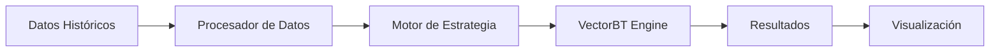

# 🔄 Ciclo de Vida del Desarrollo de Software (SDLC)

Documentación completa del ciclo de vida del desarrollo de software para el proyecto Trading Bot Híbrido.

## 📋 Tabla de Contenidos

1. [Visión General](#visión-general)
2. [Fases del SDLC](#fases-del-sdlc)
3. [Metodología](#metodología)
4. [Procesos y Workflows](#procesos-y-workflows)
5. [Control de Versiones](#control-de-versiones)
6. [CI/CD Pipeline](#cicd-pipeline)
7. [Gestión de Releases](#gestión-de-releases)

---

## 🎯 Visión General

El proyecto Trading Bot Híbrido sigue un **ciclo de vida iterativo e incremental** basado en metodologías ágiles, con énfasis en:

- **Desarrollo continuo**
- **Integración y deployment automatizados**
- **Testing exhaustivo**
- **Documentación actualizada**
- **Feedback rápido**

### Modelo SDLC Adoptado

Utilizamos un **modelo híbrido** que combina:
- **Agile/Scrum** para desarrollo iterativo
- **DevOps** para automatización y deployment
- **Continuous Integration/Continuous Deployment (CI/CD)**

---

## 📊 Fases del SDLC

### 1️⃣ Planificación (Planning)

**Objetivo**: Definir requisitos, alcance y objetivos del proyecto.

#### Actividades:
- ✅ Análisis de requisitos del negocio
- ✅ Definición de objetivos y KPIs
- ✅ Estimación de recursos y tiempo
- ✅ Análisis de riesgos
- ✅ Creación de roadmap

#### Entregables:
- **Product Backlog**
- **Roadmap del proyecto**
- **Documento de requisitos**
- **Análisis de riesgos**

#### Herramientas:
- GitHub Projects
- GitHub Issues
- Markdown docs

#### Ejemplo de Issue de Planificación:

```markdown
## Feature: Implementar estrategia de trading basada en RSI

### Descripción
Desarrollar una estrategia de trading automatizada utilizando el indicador RSI.

### Requisitos
- [ ] RSI configurable (período por defecto: 14)
- [ ] Señal de compra: RSI < 30
- [ ] Señal de venta: RSI > 70
- [ ] Backtesting con datos históricos

### Estimación
- Story Points: 5
- Tiempo estimado: 1 sprint (2 semanas)

### Prioridad
Alta

### Dependencias
- Integración con Alpaca API
- Sistema de backtesting funcional
```

---

### 2️⃣ Análisis (Analysis)

**Objetivo**: Entender en profundidad los requisitos y diseñar la solución.

#### Actividades:
- 🔍 Análisis técnico de requisitos
- 🔍 Estudio de viabilidad
- 🔍 Análisis de arquitectura
- 🔍 Definición de casos de uso
- 🔍 Diseño de base de datos

#### Entregables:
- **Especificaciones técnicas**
- **Diagramas de arquitectura**
- **Casos de uso**
- **Esquema de base de datos**

#### Ejemplo de Análisis Técnico:

```markdown
## Análisis: Sistema de Backtesting

### Tecnología Seleccionada
- **VectorBT**: Framework de backtesting vectorizado
- **Razón**: Alto rendimiento, fácil integración con pandas

### Arquitectura Propuesta


### Requisitos de Datos
- Formato: OHLCV (Open, High, Low, Close, Volume)
- Frecuencia: 1 minuto a 1 día
- Fuente: Alpaca API / Yahoo Finance

### Métricas de Rendimiento
- Retorno total
- Sharpe Ratio
- Maximum Drawdown
- Win Rate
```

---

### 3️⃣ Diseño (Design)

**Objetivo**: Crear el diseño detallado de la solución.

#### Actividades:
- 🎨 Diseño de arquitectura del sistema
- 🎨 Diseño de componentes
- 🎨 Diseño de interfaces (APIs)
- 🎨 Diseño de base de datos
- 🎨 Diseño de flujos de datos

#### Entregables:
- **Diagramas de arquitectura**
- **Diagramas de clases**
- **Diagramas de secuencia**
- **Especificaciones de API**
- **Modelo de datos**

#### Ejemplo de Diseño de Componente:

```python
"""
Diseño del componente StrategyEngine
"""

from abc import ABC, abstractmethod
from typing import Dict, Any
import pandas as pd

class TradingStrategy(ABC):
    """Clase base para todas las estrategias de trading."""
    
    def __init__(self, config: Dict[str, Any]):
        self.config = config
        self.name = config.get('name', 'UnnamedStrategy')
    
    @abstractmethod
    def generate_signals(self, data: pd.DataFrame) -> pd.DataFrame:
        """
        Genera señales de trading basadas en los datos.
        
        Args:
            data: DataFrame con OHLCV
            
        Returns:
            DataFrame con columnas 'buy' y 'sell'
        """
        pass
    
    @abstractmethod
    def calculate_indicators(self, data: pd.DataFrame) -> pd.DataFrame:
        """
        Calcula indicadores técnicos necesarios.
        
        Args:
            data: DataFrame con OHLCV
            
        Returns:
            DataFrame con indicadores calculados
        """
        pass
    
    def backtest(self, data: pd.DataFrame, initial_capital: float = 10000):
        """Ejecuta backtest de la estrategia."""
        signals = self.generate_signals(data)
        # Implementación del backtesting
        pass
```

---

### 4️⃣ Implementación (Development)

**Objetivo**: Escribir el código según el diseño establecido.

#### Actividades:
- 💻 Desarrollo de código
- 💻 Code reviews
- 💻 Unit testing
- 💻 Documentación de código
- 💻 Commits siguiendo Conventional Commits

#### Entregables:
- **Código fuente**
- **Tests unitarios**
- **Documentación inline**
- **Pull Requests**

#### Workflow de Desarrollo:

```bash
# 1. Crear rama de feature
git checkout -b feat/rsi-strategy

# 2. Desarrollar la funcionalidad
# ... escribir código ...

# 3. Ejecutar tests
pytest tests/

# 4. Commit siguiendo Conventional Commits
git add .
git commit -m "feat: implement RSI trading strategy

- Add RSIStrategy class
- Implement signal generation logic
- Add unit tests for RSI calculations
- Update documentation"

# 5. Push y crear Pull Request
git push origin feat/rsi-strategy
```

#### Estándares de Código:

```python
# ✅ BUENO: Código limpio, documentado, testeado

class RSIStrategy(TradingStrategy):
    """
    Estrategia de trading basada en el indicador RSI.
    
    Señales:
    - Compra: RSI < oversold_threshold (default: 30)
    - Venta: RSI > overbought_threshold (default: 70)
    
    Attributes:
        period (int): Período para calcular RSI
        oversold (float): Umbral de sobreventa
        overbought (float): Umbral de sobrecompra
    """
    
    def __init__(self, period: int = 14, oversold: float = 30, 
                 overbought: float = 70):
        super().__init__({'name': 'RSI Strategy'})
        self.period = period
        self.oversold = oversold
        self.overbought = overbought
    
    def calculate_rsi(self, data: pd.DataFrame) -> pd.Series:
        """
        Calcula el RSI (Relative Strength Index).
        
        Args:
            data: DataFrame con columna 'Close'
            
        Returns:
            Series con valores de RSI
        """
        delta = data['Close'].diff()
        gain = (delta.where(delta > 0, 0)).rolling(window=self.period).mean()
        loss = (-delta.where(delta < 0, 0)).rolling(window=self.period).mean()
        
        rs = gain / loss
        rsi = 100 - (100 / (1 + rs))
        return rsi
    
    def generate_signals(self, data: pd.DataFrame) -> pd.DataFrame:
        """Genera señales de compra/venta basadas en RSI."""
        data = data.copy()
        data['RSI'] = self.calculate_rsi(data)
        
        data['buy'] = data['RSI'] < self.oversold
        data['sell'] = data['RSI'] > self.overbought
        
        return data[['buy', 'sell']]
```

---

### 5️⃣ Testing (Pruebas)

**Objetivo**: Verificar que el software funciona correctamente.

#### Niveles de Testing:

##### 🧪 Unit Testing
```python
# tests/test_rsi_strategy.py
import pytest
import pandas as pd
from src.strategies.rsi_strategy import RSIStrategy

def test_rsi_calculation():
    """Test RSI calculation accuracy."""
    # Datos de prueba
    data = pd.DataFrame({
        'Close': [100, 102, 101, 103, 105, 104, 106, 108]
    })
    
    strategy = RSIStrategy(period=14)
    rsi = strategy.calculate_rsi(data)
    
    # Verificar que RSI está en rango válido
    assert (rsi >= 0).all() and (rsi <= 100).all()

def test_buy_signal_generation():
    """Test buy signal when RSI < 30."""
    data = pd.DataFrame({
        'Close': [100, 90, 85, 80, 75, 70, 65, 60]  # Tendencia bajista
    })
    
    strategy = RSIStrategy(oversold=30)
    signals = strategy.generate_signals(data)
    
    # Debería haber señales de compra
    assert signals['buy'].any()

def test_sell_signal_generation():
    """Test sell signal when RSI > 70."""
    data = pd.DataFrame({
        'Close': [100, 110, 115, 120, 125, 130, 135, 140]  # Tendencia alcista
    })
    
    strategy = RSIStrategy(overbought=70)
    signals = strategy.generate_signals(data)
    
    # Debería haber señales de venta
    assert signals['sell'].any()
```

##### 🔗 Integration Testing
```python
# tests/integration/test_alpaca_integration.py
import pytest
from src.brokers.alpaca_client import AlpacaClient

@pytest.mark.integration
def test_alpaca_connection():
    """Test connection to Alpaca API."""
    client = AlpacaClient()
    account = client.get_account()
    
    assert account is not None
    assert hasattr(account, 'buying_power')

@pytest.mark.integration
def test_place_order():
    """Test placing a paper trading order."""
    client = AlpacaClient()
    
    order = client.place_order(
        symbol='AAPL',
        qty=1,
        side='buy',
        type='market'
    )
    
    assert order.status in ['new', 'accepted', 'filled']
```

##### 🎭 End-to-End Testing
```python
# tests/e2e/test_trading_workflow.py
import pytest
from src.bot import TradingBot
from src.strategies.rsi_strategy import RSIStrategy

@pytest.mark.e2e
def test_complete_trading_workflow():
    """Test complete trading workflow from signal to execution."""
    # Inicializar bot
    bot = TradingBot(strategy=RSIStrategy())
    
    # Ejecutar ciclo de trading
    bot.run_cycle()
    
    # Verificar que se ejecutaron acciones
    assert bot.get_positions() is not None
    assert bot.get_orders() is not None
```

#### Comandos de Testing:

```bash
# Ejecutar todos los tests
pytest

# Tests unitarios solamente
pytest tests/unit/

# Tests con coverage
pytest --cov=src --cov-report=html

# Tests de integración
pytest -m integration

# Tests end-to-end
pytest -m e2e
```

---

### 6️⃣ Deployment (Despliegue)

**Objetivo**: Poner el software en producción.

#### Entornos:

1. **Development** (local)
   - Desarrollo activo
   - Tests unitarios

2. **Staging** (pre-producción)
   - Tests de integración
   - Validación de funcionalidades

3. **Production** (producción)
   - Trading real (con precaución)
   - Monitoreo continuo

#### Proceso de Deployment:

```bash
# 1. Build de la imagen Docker
docker build -t trading-bot:v1.0.0 -f docker/Dockerfile .

# 2. Tag para registry
docker tag trading-bot:v1.0.0 registry.example.com/trading-bot:v1.0.0

# 3. Push al registry
docker push registry.example.com/trading-bot:v1.0.0

# 4. Deploy en producción
docker-compose -f docker-compose.prod.yml up -d
```

#### Checklist de Deployment:

- [ ] Todos los tests pasan
- [ ] Code review aprobado
- [ ] Documentación actualizada
- [ ] Variables de entorno configuradas
- [ ] Backup de base de datos realizado
- [ ] Monitoreo configurado
- [ ] Plan de rollback preparado

---

### 7️⃣ Mantenimiento (Maintenance)

**Objetivo**: Mantener el sistema funcionando y mejorado.

#### Actividades:
- 🔧 Bug fixes
- 🔧 Actualizaciones de seguridad
- 🔧 Optimizaciones de rendimiento
- 🔧 Nuevas features
- 🔧 Refactoring

#### Tipos de Mantenimiento:

##### Correctivo
```bash
# Hotfix para bug crítico
git checkout -b hotfix/fix-order-execution
# ... fix bug ...
git commit -m "fix: correct order execution logic for market orders"
```

##### Preventivo
```python
# Agregar logging para prevenir problemas
import logging

logger = logging.getLogger(__name__)

def execute_order(symbol, qty, side):
    logger.info(f"Executing {side} order: {qty} shares of {symbol}")
    try:
        # ... código de ejecución ...
        logger.info(f"Order executed successfully")
    except Exception as e:
        logger.error(f"Order execution failed: {str(e)}")
        raise
```

##### Perfectivo
```python
# Optimización de rendimiento
# ANTES: O(n²)
def calculate_signals_slow(data):
    signals = []
    for i in range(len(data)):
        for j in range(i):
            # ... cálculo lento ...
            pass
    return signals

# DESPUÉS: O(n) - vectorizado
def calculate_signals_fast(data):
    return data.apply(lambda x: x.rolling(window=14).mean())
```

---

## 🔄 Metodología Agile/Scrum

### Sprint Planning

**Duración**: 2 semanas

**Actividades**:
1. Review del backlog
2. Selección de user stories
3. Estimación (story points)
4. Definición de sprint goal

### Daily Standups

**Formato** (async via GitHub):
```markdown
## Daily Update - 2024-12-07

### ✅ Ayer
- Implementé cálculo de RSI
- Agregué tests unitarios

### 🎯 Hoy
- Integrar RSI con motor de señales
- Documentar API

### 🚧 Blockers
- Ninguno
```

### Sprint Review

**Entregables**:
- Demo de funcionalidades
- Métricas de rendimiento
- Feedback de stakeholders

### Sprint Retrospective

**Preguntas**:
1. ¿Qué salió bien?
2. ¿Qué se puede mejorar?
3. ¿Qué acciones tomar?

---

## 🔀 Control de Versiones

### Git Workflow

Utilizamos **Git Flow**:

```
main (producción)
  ↑
develop (desarrollo)
  ↑
feature/* (nuevas features)
hotfix/* (fixes urgentes)
release/* (preparación de releases)
```

### Conventional Commits

Formato:
```
<type>(<scope>): <subject>

<body>

<footer>
```

Tipos:
- `feat`: Nueva funcionalidad
- `fix`: Bug fix
- `docs`: Documentación
- `style`: Formato de código
- `refactor`: Refactorización
- `test`: Tests
- `chore`: Tareas de mantenimiento

Ejemplos:
```bash
feat(strategies): add RSI trading strategy

Implement RSI-based trading strategy with configurable
oversold/overbought thresholds.

- Add RSIStrategy class
- Implement signal generation
- Add unit tests
- Update documentation

Closes #123
```

```bash
fix(alpaca): correct order execution for fractional shares

Fixed issue where fractional shares were not being handled
correctly in market orders.

Fixes #456
```

---

## 🚀 CI/CD Pipeline

### GitHub Actions Workflow

```yaml
# .github/workflows/ci.yml
name: CI/CD Pipeline

on:
  push:
    branches: [ main, develop ]
  pull_request:
    branches: [ main, develop ]

jobs:
  test:
    runs-on: ubuntu-latest
    
    steps:
    - uses: actions/checkout@v3
    
    - name: Set up Python
      uses: actions/setup-python@v4
      with:
        python-version: '3.10'
    
    - name: Install dependencies
      run: |
        python -m pip install --upgrade pip
        pip install -r requirements.txt
        pip install pytest pytest-cov
    
    - name: Run tests
      run: |
        pytest --cov=src --cov-report=xml
    
    - name: Upload coverage
      uses: codecov/codecov-action@v3
  
  lint:
    runs-on: ubuntu-latest
    
    steps:
    - uses: actions/checkout@v3
    
    - name: Set up Python
      uses: actions/setup-python@v4
      with:
        python-version: '3.10'
    
    - name: Lint with flake8
      run: |
        pip install flake8
        flake8 src/ --max-line-length=100
  
  deploy:
    needs: [test, lint]
    runs-on: ubuntu-latest
    if: github.ref == 'refs/heads/main'
    
    steps:
    - uses: actions/checkout@v3
    
    - name: Build Docker image
      run: docker build -t trading-bot:latest .
    
    - name: Deploy to production
      run: |
        # Deployment script
        echo "Deploying to production..."
```

---

## 📦 Gestión de Releases

### Versionado Semántico

Formato: `MAJOR.MINOR.PATCH`

- **MAJOR**: Cambios incompatibles
- **MINOR**: Nueva funcionalidad compatible
- **PATCH**: Bug fixes compatibles

Ejemplos:
- `1.0.0` - Primera versión estable
- `1.1.0` - Nueva estrategia de trading
- `1.1.1` - Fix de bug menor

### Proceso de Release

```bash
# 1. Crear rama de release
git checkout -b release/v1.1.0 develop

# 2. Actualizar versión
# Editar configs/config.yaml
version: "1.1.0"

# 3. Commit de versión
git commit -am "chore: bump version to 1.1.0"

# 4. Merge a main
git checkout main
git merge --no-ff release/v1.1.0

# 5. Tag
git tag -a v1.1.0 -m "Release version 1.1.0"

# 6. Push
git push origin main --tags

# 7. Merge de vuelta a develop
git checkout develop
git merge --no-ff release/v1.1.0

# 8. Eliminar rama de release
git branch -d release/v1.1.0
```

### Release Notes

```markdown
# Release v1.1.0 - 2024-12-07

## 🎉 New Features
- Added RSI trading strategy (#123)
- Implemented Telegram alerts for trade execution (#145)
- Added backtesting dashboard (#167)

## 🐛 Bug Fixes
- Fixed order execution for fractional shares (#456)
- Corrected timezone handling in market data (#478)

## 🔧 Improvements
- Optimized signal calculation performance (30% faster)
- Enhanced error handling in API calls
- Updated documentation

## 📚 Documentation
- Added SDLC documentation
- Updated API reference
- Added strategy examples

## ⚠️ Breaking Changes
None

## 🔄 Migration Guide
No migration needed for this release.
```

---

## 📊 Métricas y KPIs

### Métricas de Desarrollo

- **Velocity**: Story points completados por sprint
- **Lead Time**: Tiempo desde commit hasta producción
- **Cycle Time**: Tiempo desde inicio hasta completado
- **Code Coverage**: % de código cubierto por tests (objetivo: >80%)

### Métricas de Calidad

- **Bug Rate**: Bugs por 1000 líneas de código
- **Code Churn**: % de código modificado
- **Technical Debt**: Tiempo estimado para resolver deuda técnica

### Métricas de Deployment

- **Deployment Frequency**: Frecuencia de deploys
- **Mean Time to Recovery (MTTR)**: Tiempo promedio de recuperación
- **Change Failure Rate**: % de deploys que fallan

---

## 🛠️ Herramientas

### Desarrollo
- **IDE**: VS Code, PyCharm
- **Version Control**: Git, GitHub
- **Package Manager**: pip, poetry

### Testing
- **Unit Testing**: pytest
- **Coverage**: pytest-cov
- **Linting**: flake8, pylint
- **Type Checking**: mypy

### CI/CD
- **CI**: GitHub Actions
- **Containerization**: Docker
- **Orchestration**: Docker Compose

### Monitoreo
- **Logging**: Python logging
- **Metrics**: Prometheus (futuro)
- **Alerting**: Telegram Bot

---

## 📚 Referencias

- [Agile Manifesto](https://agilemanifesto.org/)
- [Conventional Commits](https://www.conventionalcommits.org/)
- [Semantic Versioning](https://semver.org/)
- [Git Flow](https://nvie.com/posts/a-successful-git-branching-model/)
- [The Twelve-Factor App](https://12factor.net/)

---

## ✅ Checklist de SDLC

### Para cada Feature
- [ ] Requisitos definidos en issue
- [ ] Diseño técnico documentado
- [ ] Código implementado siguiendo estándares
- [ ] Tests unitarios escritos (coverage >80%)
- [ ] Code review completado
- [ ] Documentación actualizada
- [ ] Tests de integración pasando
- [ ] Merged a develop
- [ ] Deployed a staging
- [ ] Validación en staging
- [ ] Merged a main
- [ ] Deployed a producción
- [ ] Monitoreo activo
- [ ] Release notes publicadas

---

**Última actualización**: 2024-12-07  
**Versión del documento**: 1.0.0
